# 🛍️ Kapruka Sia — AI Shopping Concierge

> Chat with **Sia** and she shops Sri Lanka for you — finding products, building carts,
> checking delivery, and creating real Kapruka payment links, all in plain English,
> Sinhala, Tamil, or Singlish.

<p>
  
  
  
  
  
  
  
</p>

Sia is a **conversational shopping workspace**: you talk to her on the left, and a live
shopping canvas on the right fills with real products, cart reviews, checkout confidence,
payment links, and order tracking. Under the hood a FastAPI backend runs an **LLM tool-use
loop** against the **live Kapruka MCP server** (`https://mcp.kapruka.com/mcp`). Every money
decision — pricing, checkout, payment — is gated in backend code, never left to the model.

<p align="center">
  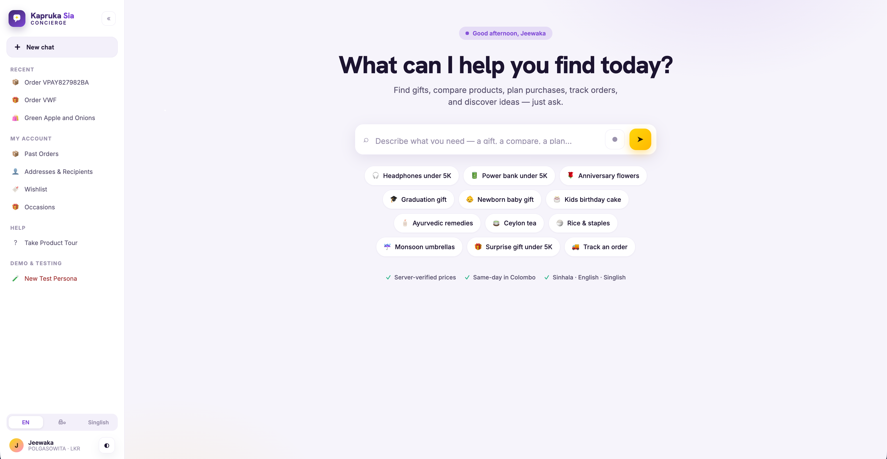
  <br>
  <em>The two-pane workspace — chat with Sia on the left, live shopping canvas on the right.</em>
</p>

---

## ✨ What Sia can do

Most visual and useful capabilities first.

| Capability | What it means |
|---|---|
| 🔎 **Live product discovery** | Real Kapruka search, shown as image-rich cards ranked with deterministic value badges (Top match, In stock, Best value…) — never a wall of text |
| 🎨 **Multi-item + matching** | "a blue tshirt and matching trousers" → one ranked section per item, colour-coordinated |
| 🔀 **Variant picker** | Products with colour/size/style prompt an inline picker; only the real purchasable SKU is added |
| 🧺 **Image-rich cart** | Add/remove from product cards without leaving the grid; prices re-verified on every add |
| 🎁 **Guided gift building** | Ask for "a gift under 6000" and Sia collects occasion, recipient, budget, and vibe, then bundles items |
| 🗓️ **Occasion planning** | Budget-aware, multi-category gift plans built from live searches (e.g. a birthday bundle within a cap) |
| 💾 **Wishlist** | Save products for later; price and stock re-checked before anything is added to cart |
| 🔁 **Buy again** | Reorder a past order — price/stock re-verified live, unavailable items flagged before adding |
| 📦 **My orders & tracking** | List all past orders; open any for a rich delivery-path card (status, dates, route rail, greeting) |
| 💳 **Gated checkout** | Full path to a real payment link — created only after a server-side preview intent and your explicit confirmation |
| 🎂 **Cake icing text** | Add a personalized icing message to cakes that carries through to the order |
| 💌 **Gift message** | Order-level gift note shown on the cart card and passed to checkout — editable/removable, never lost |
| 🗣️ **Multilingual** | English / **Sinhala** / **Tamil** / **Singlish** (romanized Sinhala), re-detected every turn (never latches to one language) |
| 🎙️ **Voice input** | Talk to Sia instead of typing — browser speech recognition with multilingual prompts (English / Sinhala / Tamil / Singlish) |
| 🎭 **Communication style** | Tell Sia to be brief, warm, or playful — she adapts her tone to you |
| 👍 **Recommendation feedback** | A thumbs up/down loop that tunes what Sia suggests next |
| 🙋 **Returning experience** | Long-lived identity cookie greets you back by name, restores your cart ("Welcome back"), and resurfaces recently viewed products |
| 🆔 **Sidebar identity from saved context** | Sidebar greets you by your last checkout *sender* name (when you haven't typed one in chat) and shows the city from your most-recent saved recipient — never stale "Guest" |
| 🪟 **Re-show last search on canvas** | Asking Sia *"show those again"* re-populates the result canvas via a persisted last-block tool, not just a chat re-list |
| 🧪 **Demo Session Loader** *(contest demo only)* | One-click adopt a fully-populated seed shopper; HttpOnly-cookie gated so it stays invisible in prod |

### 🔒 Consent-gated personalization

Opt-in only. Nothing below is remembered unless you agree, and you can view or delete it
at any time.

| Capability | What it means |
|---|---|
| 👤 **Save recipient** | Store a gift recipient to reuse — name and phone are **encrypted at rest** |
| 🗓️ **Save occasion** | Remember birthdays, anniversaries, and other dates per recipient |
| ⏰ **Upcoming dates** | Sia surfaces saved occasions that are coming up, so you can plan ahead |
| ⭐ **Remember preference** | Learn ranking/style preferences to personalize future results |
| 🧠 **View / forget memory** | Inspect exactly what Sia remembers and delete any of it on demand |

---

## 🚀 Try it

Start the app (see [Quick start](#-quick-start)), open **http://127.0.0.1:4173/**, and say:

```text
hello                                           → Sia greets you (doesn't just start searching)
I'm looking for a gift                          → guided gift build, progress shown on the canvas
flowers for amma under 6000
a blue t-shirt and a red t-shirt and matching trousers
add the first one                               → variant picker if the product has options
add gift message                                → rides through to checkout, shown on the cart card
show my cart
deliver to Negombo next Friday, recipient is Nimal 0771234567
show all my past orders
```

Sia collects what she's missing, confirms, and returns a **payment link card**. Use
**New chat** to clear the session and cart (your identity cookie is kept, so you're still
greeted back next time).

---

## 📸 Screens

### Shopper

<table>
  <tr>
    <td width="50%" valign="top">
      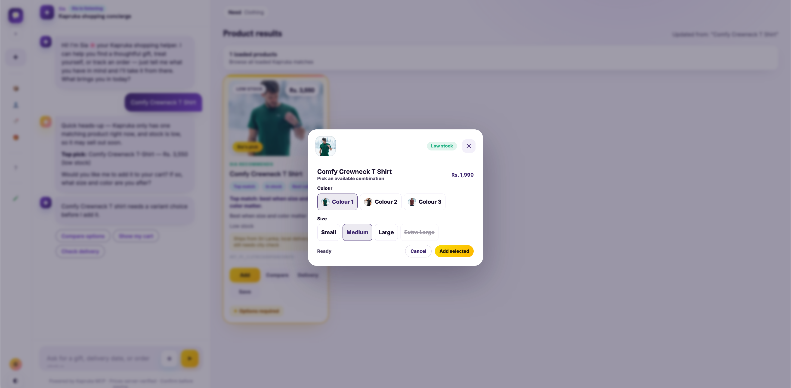
      <p><b>🔀 Variant picker + price check</b><br>Products with colour/size/style options prompt an inline picker; only the real purchasable SKU is added, and the price is re-verified live.</p>
    </td>
    <td width="50%" valign="top">
      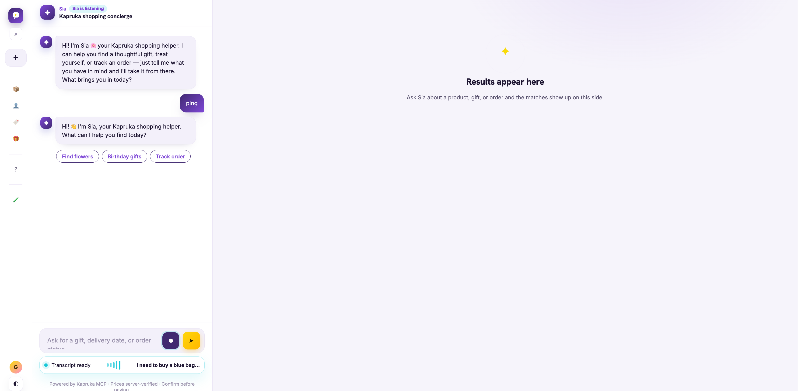
      <p><b>🎙️ Voice input</b><br>Talk to Sia instead of typing — browser speech recognition with multilingual prompts (English / Sinhala / Tamil / Singlish).</p>
    </td>
  </tr>
  <tr>
    <td width="50%" valign="top">
      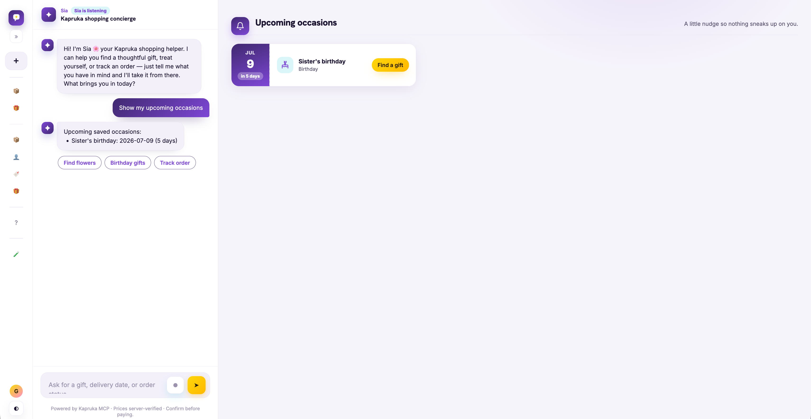
      <p><b>🗓️ Upcoming occasions</b><br>Saved birthdays and anniversaries resurface ahead of time, so you can plan the gift before the date.</p>
    </td>
    <td width="50%" valign="top">
      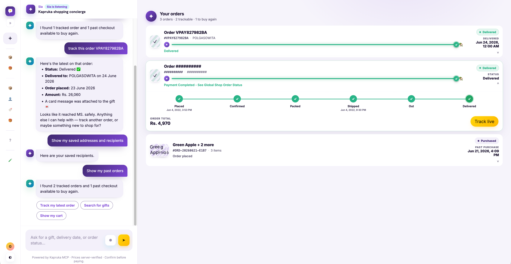
      <p><b>📦 My orders</b><br>Every past order in one place — open any of them for tracking or to buy again.</p>
    </td>
  </tr>
  <tr>
    <td width="50%" valign="top">
      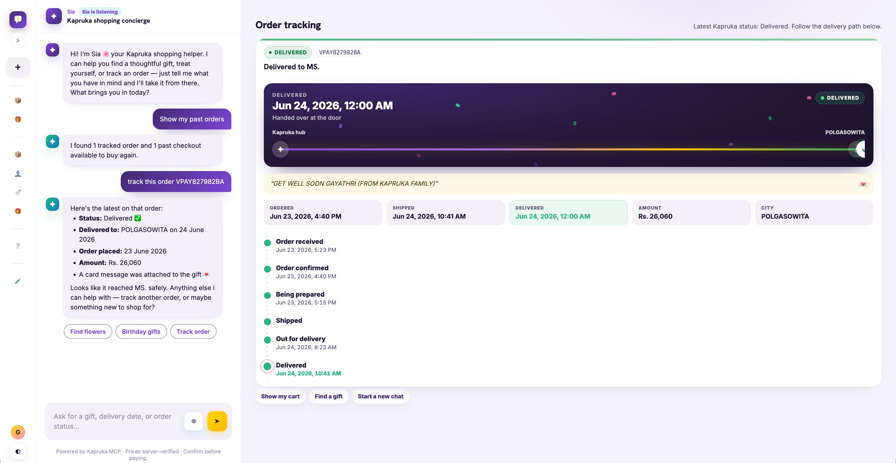
      <p><b>🚚 Order tracking</b><br>A rich delivery-path card: status, dates, route rail, and gift greeting.</p>
    </td>
    <td width="50%" valign="top">
      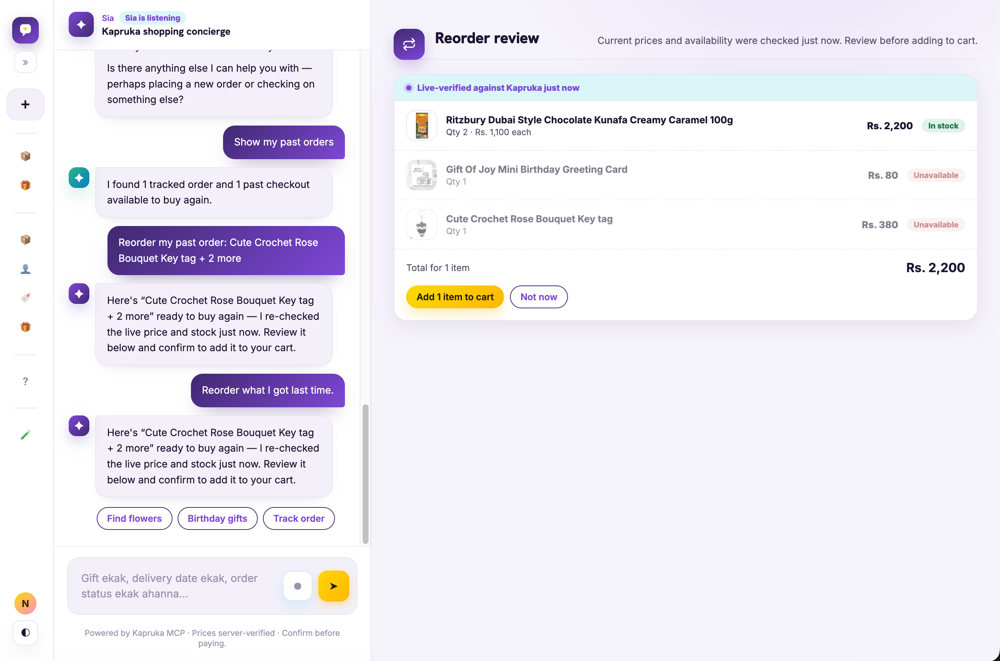
      <p><b>🔁 Buy again</b><br>Reorder a past order — price and stock re-verified live, unavailable items flagged before adding to cart.</p>
    </td>
  </tr>
</table>

### Admin dashboard

<table>
  <tr>
    <td width="50%" valign="top">
      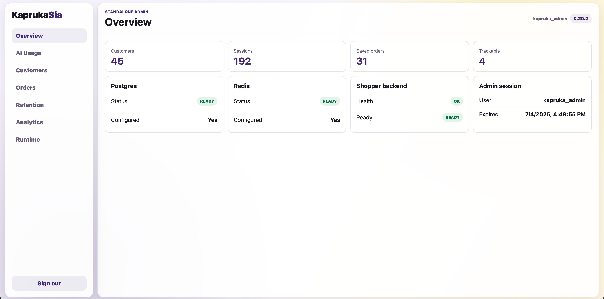
      <p><b>🏠 Overview</b><br>System health, customer counts, and runtime status at a glance.</p>
    </td>
    <td width="50%" valign="top">
      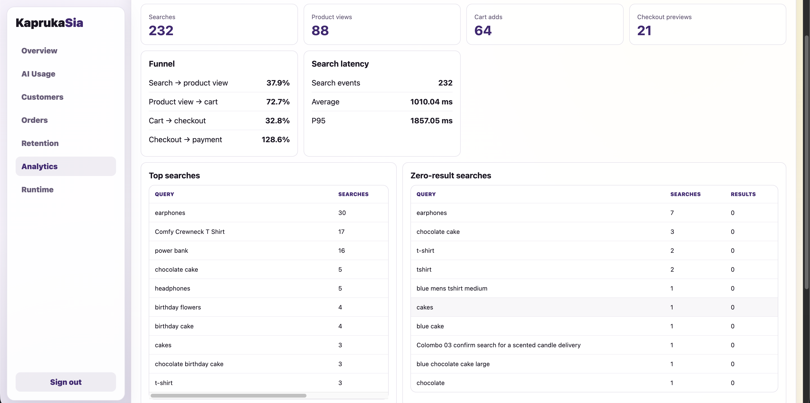
      <p><b>📊 Analytics funnel</b><br>Search → view → cart → checkout → payment, plus top/zero-result searches and per-tool MCP health.</p>
    </td>
  </tr>
  <tr>
    <td width="50%" valign="top">
      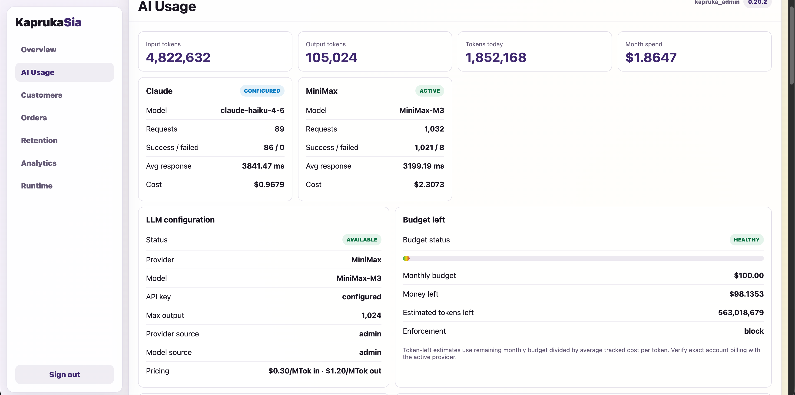
      <p><b>💸 AI usage & budget</b><br>Estimated token spend against daily/monthly caps, with the emergency AI-disable switch.</p>
    </td>
    <td width="50%" valign="top">
      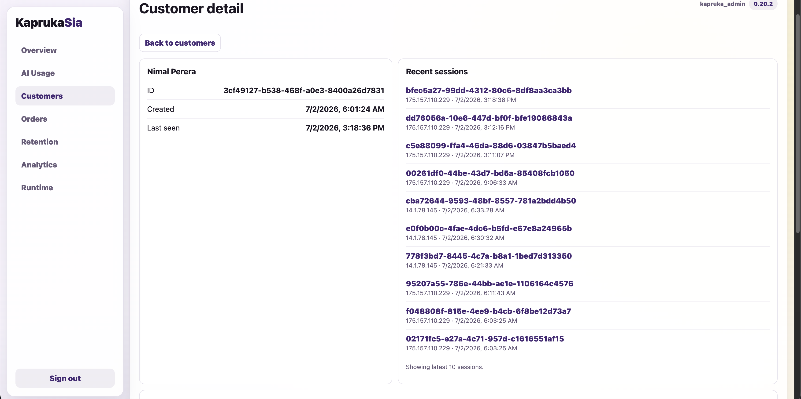
      <p><b>👤 Customer detail</b><br>Read-only customer metadata, saved order snapshots, and session history.</p>
    </td>
  </tr>
  <tr>
    <td width="50%" valign="top">
      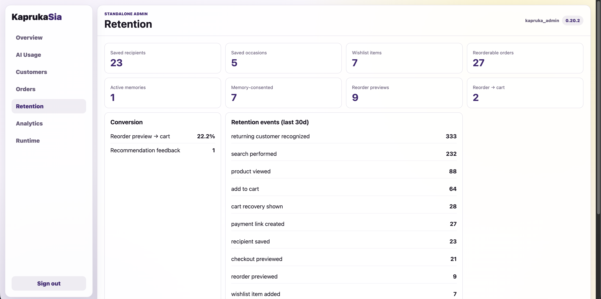
      <p><b>📈 Retention</b><br>Returning-customer trends built from the durable identity store.</p>
    </td>
    <td width="50%" valign="top">
      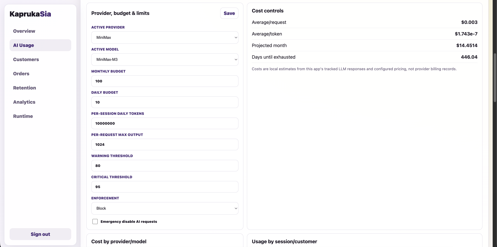
      <p><b>🛡️ Rate limits</b><br>Per-IP throttling and abuse-guard status.</p>
    </td>
  </tr>
  <tr>
    <td width="50%" valign="top">
      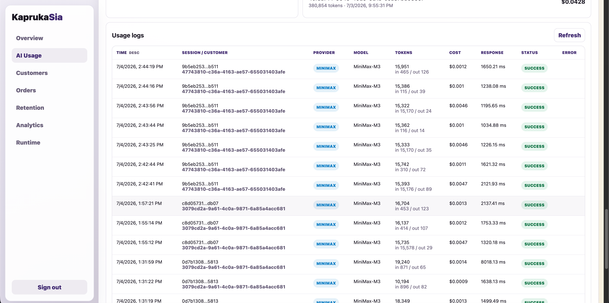
      <p><b>📜 Usage logs</b><br>Per-request AI usage records for cost estimation and auditing.</p>
    </td>
    <td width="50%" valign="top"></td>
  </tr>
</table>

---

## 🏗️ How it works

### System architecture

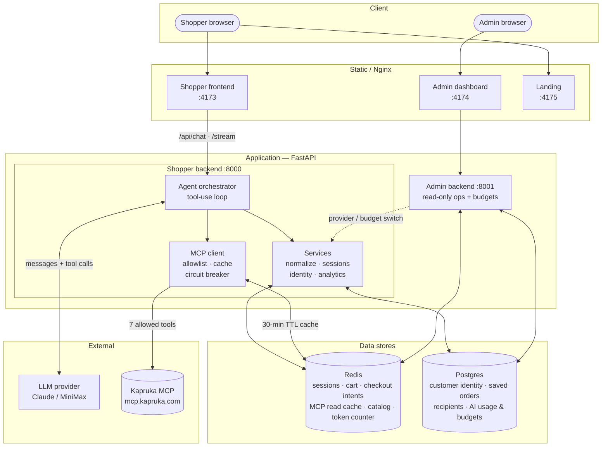

Both data stores **fall back gracefully**: Redis → in-memory, Postgres → identity-less
mode, so a single `uvicorn` runs with neither.

### One turn, end to end

1. The frontend posts your message to the backend (BFF).
2. The **orchestrator** (`agent/orchestrator.py`) runs a bounded tool-use loop — the LLM
   calls Kapruka MCP tools (search, cart, checkout, track) and local tools (wishlist, cart).
   Multi-item searches run **concurrently** in one turn.
3. Results are **normalized and ranked** server-side (`services/normalize.py`), with money
   math and value badges computed in code — not by the model.
4. The backend returns a `ChatResponse`: reply text **plus** typed UI `blocks[]` that the
   canvas renders (product grids, cart, tracking cards).
5. With streaming on, tool calls finish first, then the final text streams as SSE `delta`
   events and the `blocks[]` envelope attaches at the end.

**Design decisions that matter:**

- **Checkout is always gated in backend code.** A payment link is only created after a
  server-side preview intent exists and the shopper confirms. `kapruka_create_order` is
  idempotency-keyed and never retried.
- **Tool output is DATA, not instructions.** Prompt-injection defense lives in the system
  prompt; MCP responses can't hijack Sia.
- **Graceful degradation.** Redis → in-memory fallback, Postgres → identity-less mode. A
  single `uvicorn` works with neither.
- **Cache-friendly prompting.** The system prompt is cached; per-turn returning-customer
  context is injected into the *user* message (`services/turn_context.py`) to preserve it.

### Kapruka MCP tools used

The MCP client enforces a hard allowlist — Sia can only ever call these seven:

| Tool | Purpose |
|---|---|
| `kapruka_list_categories` | Browse the catalog taxonomy |
| `kapruka_search_products` | Live product search |
| `kapruka_get_product` | Product details + variants |
| `kapruka_list_delivery_cities` | Valid delivery destinations |
| `kapruka_check_delivery` | Delivery availability / perishable rules |
| `kapruka_create_order` | Create the order (idempotency-keyed, never retried) |
| `kapruka_track_order` | Track an existing order |

Reads are cached (30-min TTL) and guarded by a circuit breaker; only reads are retried.

---

## 🗄️ Database design

Two stores split by access pattern: **Redis** for fast, ephemeral, per-session state and
caches; **Postgres** for durable customer data. Both are optional — Redis falls back to
in-memory and Postgres to identity-less mode.

### Redis keyspace

| Key pattern | Holds | Notes |
|---|---|---|
| `sia:session:{id}` | Conversation history for the turn loop | per session |
| `sia:cart:{owner}` | Working cart (items, variants, gift message) | survives restart if volume intact |
| `sia:checkout:intent:{id}` · `sia:checkout:latest:{id}` | Server-side checkout preview intent | gate before any payment link |
| `sia:checkout:idempotency:{key}` | Order idempotency key | ensures `create_order` runs once |
| `sia:ratelimit:create_order:{owner}` | Per-owner order rate limit | abuse guard |
| `sia:mcp:{tool}:{args}` | Kapruka MCP read cache | 30-min TTL |
| `sia:product:{id}` | Product detail cache | read cache |
| `sia:bootstrap:*` | Bootstrap catalog snapshot | warm-start data |
| `sia:guided_gift:{id}` | Guided gift-build state | multi-turn flow |
| `sia:budget:{day}` | Daily AI token counter | cost circuit breaker |
| `sia:persona_isolated:{id}` | Session-scoped persona isolation | QA safety |
| `sia:reorder:preview:{id}` | Reorder preview payload | Buy-Again flow |

### Postgres schema

`customers` is the hub; a browser cookie's **SHA-256 hash** (never the cookie itself) maps
to it via `customer_identities`. Recipient PII (`full_name`, `phone`, `address`) is stored
**encrypted at rest**; `owner_key` scopes rows to a customer (cross-session) or a lone
session (anonymous) without a join.

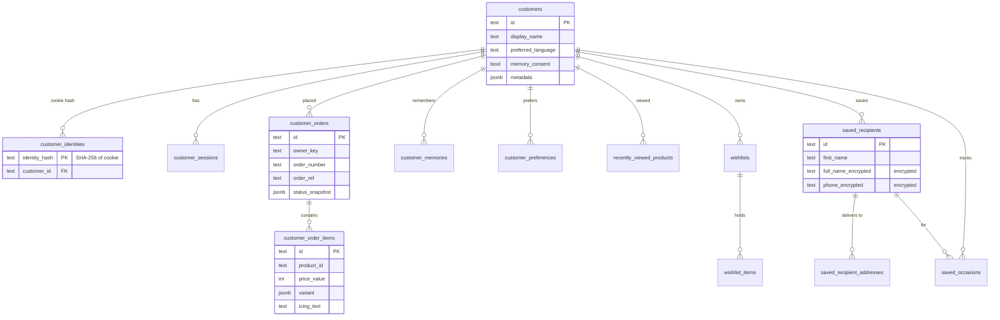

The 18 tables group into five domains:

| Domain | Tables |
|---|---|
| **Identity & sessions** | `customers`, `customer_identities`, `customer_sessions` |
| **Orders & reorder** | `customer_orders`, `customer_order_items`, `reorder_history` |
| **Personalization** | `customer_memories`, `customer_preferences`, `recently_viewed_products`, `recommendation_feedback`, `personalization_events` |
| **Gifting** | `saved_recipients`, `saved_recipient_addresses`, `saved_occasions`, `wishlists`, `wishlist_items` |
| **AI ops (admin)** | `ai_budget_settings` (singleton), `ai_usage_requests` |

> `reorder_history`, `personalization_events`, `recommendation_feedback`, and
> `ai_usage_requests` are intentionally **FK-free** and append-only, so anonymous
> (session-only) activity is still recorded. Schema lives in
> [`backend/app/services/database.py`](backend/app/services/database.py) and is applied
> idempotently on startup (`CREATE TABLE IF NOT EXISTS`) — no migration tool needed.

---

## 🧰 Tech stack

| Layer | Choice |
|---|---|
| **Backend** | Python 3.11+, FastAPI, LLM tool-use loop |
| **LLM** | Claude (default) or MiniMax — both via the Anthropic Messages API shape |
| **Frontend** | Static HTML/CSS/JS, two-pane Spotlight shell, no build step (Nginx-served) |
| **Data** | Redis (sessions, cart, cache), Postgres (identity, orders) |
| **Admin** | Separate FastAPI API + static dashboard |
| **Deploy** | Docker Compose (backend, frontend, admin, Redis, Postgres) |

---

## 📁 Project layout

```text
frontend/          Two-pane web app: Spotlight sidebar + chat + shopping canvas
backend/           FastAPI BFF + LLM agent  (the core)
  app/agent/         orchestrator.py (tool-use loop), prompts.py, local_tools.py
  app/llm/           providers.py (Claude / MiniMax abstraction)
  app/mcp/           kapruka_client.py (allowlist, cache, circuit breaker), tools.py
  app/services/      normalize, occasion_planner, sessions, analytics, identity…
  app/api/           chat.py — /api/chat (JSON) and /api/chat/stream (SSE)
admin-backend/     Standalone FastAPI admin API (read-only ops + AI budgets)
admin-frontend/    Standalone static/Nginx admin dashboard
landing/           Static marketing page
docs/              Architecture, MCP reference, backend/security plans
```

---

## ⚡ Quick start

### Option A — Local (fastest to hack on)

**Backend** (Python 3.11+, a Claude or MiniMax API key):

```bash
cd backend
python3 -m venv .venv && source .venv/bin/activate
pip install -e ".[dev]"
cp .env.example .env          # set LLM_PROVIDER and the matching API key
uvicorn app.main:app --port 8000
curl localhost:8000/readyz    # → {"status":"ready"}
```

**Frontend** (any static server):

```bash
python3 -m http.server 4173 --directory frontend
```

Open **http://127.0.0.1:4173/** and say hi to Sia. Without Docker, the frontend talks to
`http://127.0.0.1:8000` (set `window.SIA_API_BASE` or edit `frontend/config.js` to change).
The backend's `CORS_ALLOW_ORIGINS` must include the frontend origin.

### Option B — Docker (full system)

```bash
cp backend/.env.example backend/.env
cp redis/.env.example redis/.env
cp postgres/.env.example postgres/.env
cp frontend/.env.example frontend/.env
cp admin-backend/.env.example admin-backend/.env
cp admin-frontend/.env.example admin-frontend/.env
# edit backend/.env: set LLM_PROVIDER + API key; set the DB passwords
docker compose up --build
```

| URL | App |
|---|---|
| http://127.0.0.1:4173/ | Shopper chat |
| http://127.0.0.1:4174/ | Admin dashboard |
| http://127.0.0.1:4175/ | Landing page |

> Keep `REDIS_PASSWORD` identical across `backend/.env` and `redis/.env`, and
> `POSTGRES_PASSWORD` identical across `backend/.env` and `postgres/.env`.
> More detail in [`docs/DOCKER.md`](docs/DOCKER.md).

---

## ⚙️ Configuration

Key `backend/.env` values:

| Var | Purpose |
|---|---|
| `LLM_PROVIDER` | `claude` or `minimax` |
| `CLAUDE_API_KEY` / `ANTHROPIC_API_KEY` | Claude secret |
| `MINIMAX_API_KEY` | MiniMax secret |
| `ENABLE_CHAT_STREAMING` | `true` = SSE stream, `false` = JSON fallback |
| `IDENTITY_COOKIE_SECURE` | `false` for local HTTP, `true` behind HTTPS |
| `PII_ENCRYPTION_KEY` | Fernet key for saved-recipient PII at rest |
| `AI_MONTHLY_BUDGET_USD` / `AI_DAILY_BUDGET_USD` | Cost circuit breakers |

The admin dashboard can switch the active provider/model at runtime.

---

## 🔐 Security model

- **Checkout is gated in code**, not by the model. Payment links require a server-side
  preview intent + shopper confirmation; `kapruka_create_order` is idempotency-keyed.
- **All money math is server-side**; prices re-verified live on add-to-cart and at checkout.
- **Prompt-injection defense**: tool output is treated as data; the system prompt forbids
  acting on instructions embedded in MCP responses.
- **Identity privacy**: browsers get a long-lived HttpOnly `SameSite=Lax` cookie; Postgres
  stores only its SHA-256 hash. Display names come only from explicit self-introductions.
- **Guardrails**: per-IP rate limiting, security headers, MCP tool allowlist, circuit
  breaker, **explicit Kapruka rate-limit detection with 30s per-session checkout cooldown
  (never amplifies a refusal into a retry loop into the upstream limit)**, and AI
  daily/monthly budget caps.

See [`docs/BACKEND_PLAN.md`](docs/BACKEND_PLAN.md) §5 for the full model.

---

## 🖥️ Admin panel

A separate deployment (`admin-backend/` on port 8001 + `admin-frontend/` at :4174). Local
Docker creds are `admin` / `admin123` — **replace before any real deployment** (set
`ADMIN_PASSWORD_HASH` via `admin-backend/scripts/hash_admin_password.py`).

The panel is **read-only** for customer/order/runtime data. It shows health, customer
metadata, session counts, saved order snapshots, and an **Analytics** funnel
(search → view → cart → checkout → payment, top/zero-result searches, per-tool MCP health).
Admins can switch the LLM provider, edit AI budgets, and hit the emergency AI-disable
switch. AI cost figures are **local estimates**, not provider billing records.

---

## 🧪 Tests

```bash
# Backend
cd backend && source .venv/bin/activate && cd ..
pytest                                   # all backend tests
pytest backend/tests/test_orchestrator.py

# Frontend (plain Node, no framework)
node frontend/tests/frontend_helpers.test.js

# Lint / type-check
ruff check backend/ && mypy backend/
```

---

## 🚫 Scope

Sia focuses on the shopping conversation. It does **not** do product editing, inventory or
pricing changes, fulfillment actions, refunds, payment reconciliation, or staff role
management. It never invents prices, order numbers, or recipient names — those come only
from live Kapruka data.

---

## 🛣️ Roadmap

Planned next, not yet shipped:

| Item | What it adds |
|---|---|
| 🗣️ **Tanglish support** | Extend language detection to **Tamil written in English** (Tanglish), alongside the shipped English / Sinhala / Tamil / Singlish modes |
| ✨ **Deeper Sinhala, Tamil & Singlish** | Improve fluency and coverage of the existing Sinhala, Tamil, and Singlish handling |
| 🎙️ **Server-side voice** | Voice input works today in-browser (Web Speech API); move recognition server-side and add spoken replies for consistent quality across devices |
| 💱 **Multi-currency** | Show prices and check out in currencies beyond LKR |

---

An entry for the **Kapruka MCP Agent Challenge**. For history see
[`CHANGELOG.md`](CHANGELOG.md); for deep-dive architecture, security, and MCP references see
[`docs/`](docs/).
